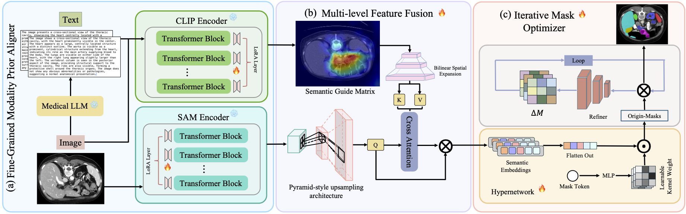

# PG-SAM: Prior-Guided Segment Anything Model for Medical Image Segmentation

[](LICENSE)
[](https://www.python.org/)

Segment Anything Model (SAM) demonstrates powerful zero-shot capabilities, but struggles with medical image segmentation due to domain gaps. PG-SAM addresses this through **fine-grained modality alignment** using medical text priors from LLMs and a **multi-level feature fusion decoder**, achieving state-of-the-art performance on the Synapse dataset.
https://arxiv.org/abs/2503.18227



## Key Features
🏥 Medical Domain Expertise 
  - Achieve precise alignment between radiology reports and imaging data through fine-grained integration.

🛠 Flexible Architecture
  - Built with modular components that seamlessly integrate data processing, training, and evaluation.

🤖 Self-Optimizing Learning
  - Employs an iterative mask optimizer that automatically refines segmentation boundaries.

🩺 Domain-Specific Excellence
  - Enhances medical image segmentation through precise alignment of radiology reports with imaging data.


## Installation
### 1. Clone Repository
```bash
git clone https://github.com/logan-0623/PG-SAM.git
cd PG-SAM
git lfs install  # Required for model weights
git lfs pull
```

### 2. Set Up Environment
```bash
conda create -n pg-sam python=3.10 -y
conda activate pg-sam
pip install -r requirements.txt
```

## Dataset Preparation
### Directory Structure
```text
PG-SAM/
├── trainset/               # Training data
│   ├── output_image_text_pairs/     # 10% subset (text+image)
│   ├── output_image_text_pairs_all_1/  # Full dataset
│   └── train_npz_new_224/          # Original 224px images
├── testset/
│   └── test_vol_h5/            # Test data
│       └── output_image_text_pairs/texts/  # Annotations
```

### Setup Steps
1. **Download Data** from [Google Drive](https://drive.google.com/drive/folders/1Wu-OjKifrVth_I5VLHK6pA7IuAo4Rp2d):
2. Download these two zip files:
     - `trainset.zip` (Training Set)
     - `testset.zip` (Test Set)

2. **Unzip Files**:
   ```bash
   unzip trainset.zip -d PG-SAM/trainset/
   unzip testset.zip -d PG-SAM/testset/
   ```

### Verification
```text
 Expected output:
 
 PG-SAM/
 ├── datasets/     # Dataloader code
 ├── trainset/     # Training set 
 │   ├── output_image_text_pairs/   # 10% of train data
 │   ├── output_image_text_pairs_all_1/    # full train data
 │   └── train_npz_new_224/    # the original data (without text)
 ├── testset/      # Test set 
 │   ├── test_vol_h5/   # Test images and texts
 │   │   ├── output_image_text_pairs/    
 │   │   │   └── texts/    
...
```

## Usage
### Quick Inference Demo
```bash
CUDA_VISIBLE_DEVICES="0"  python LORA.py 
```

### Training
Default configuration (single GPU):
```bash
CUDA_VISIBLE_DEVICES="0"  python train.py \
  --base_lr 0.0026 \
  --img_size 224 \ 
  --warmup \
  --AdamW \
  --max_epochs 300
```

### Evaluation
```bash
CUDA_VISIBLE_DEVICES="0" python test.py \
  --checkpoint model_weights/pg-sam-final.pt \
  --data_dir testset/test_vol_h5
```

## Configuration Options
| Parameter          | Default | Description                  |
|--------------------|---------|------------------------------|
| `--base_lr`        | 0.0026  | Base learning rate           |
| `--img_size`       | 224     | Input image resolution       |
| `--warmup`         | True    | Enable learning rate warmup  |
| `--max_epochs`     | 300     | Total training epochs        |

## Citation

```
@misc{zhong2025pgsampriorguidedsammedical,
      title={PG-SAM: Prior-Guided SAM with Medical for Multi-organ Segmentation}, 
      author={Yiheng Zhong and Zihong Luo and Chengzhi Liu and Feilong Tang and Zelin Peng and Ming Hu and Yingzhen Hu and Jionglong Su and Zongyuan Geand and Imran Razzak},
      year={2025},
      eprint={2503.18227},
      archivePrefix={arXiv},
      primaryClass={cs.CV},
      url={https://arxiv.org/abs/2503.18227}, 
}
```


## License
This project is licensed under the MIT License - see [LICENSE](LICENSE) for details.
